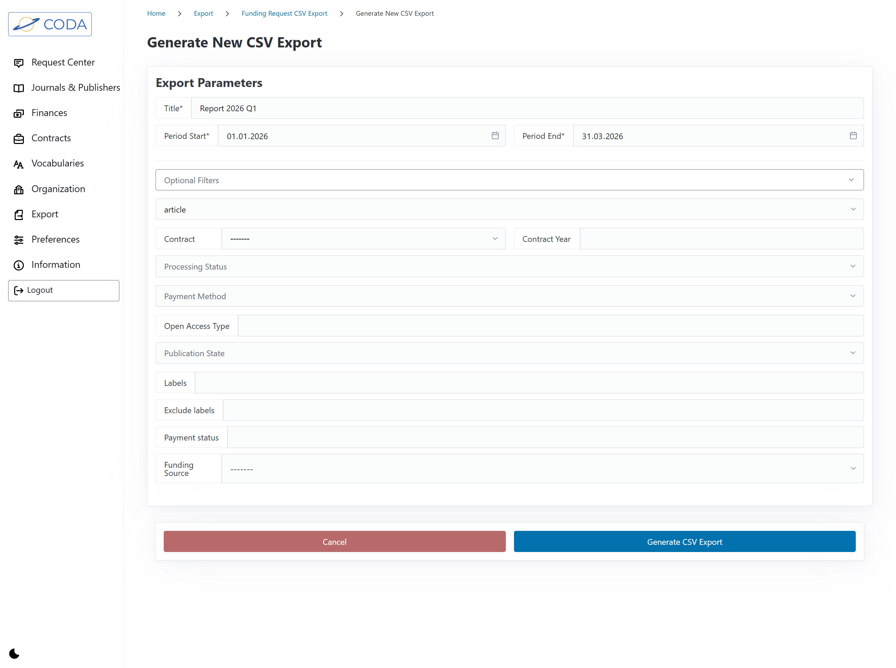
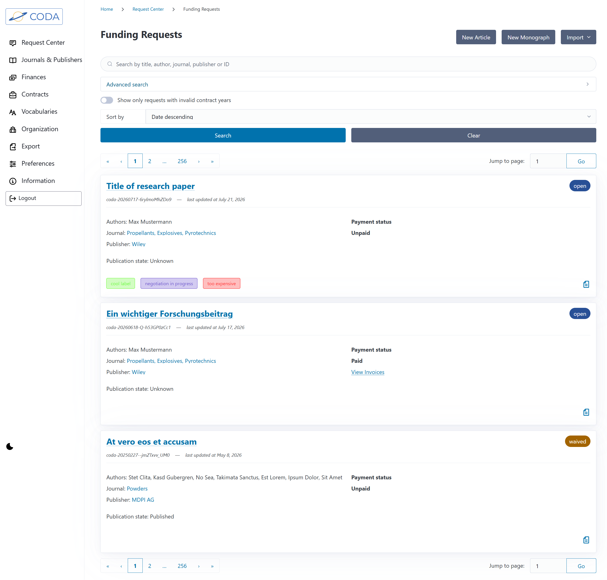
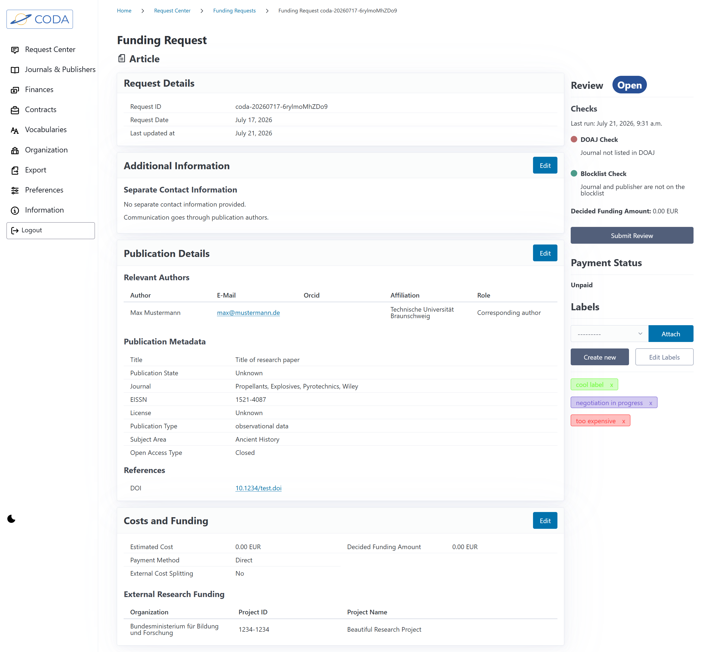
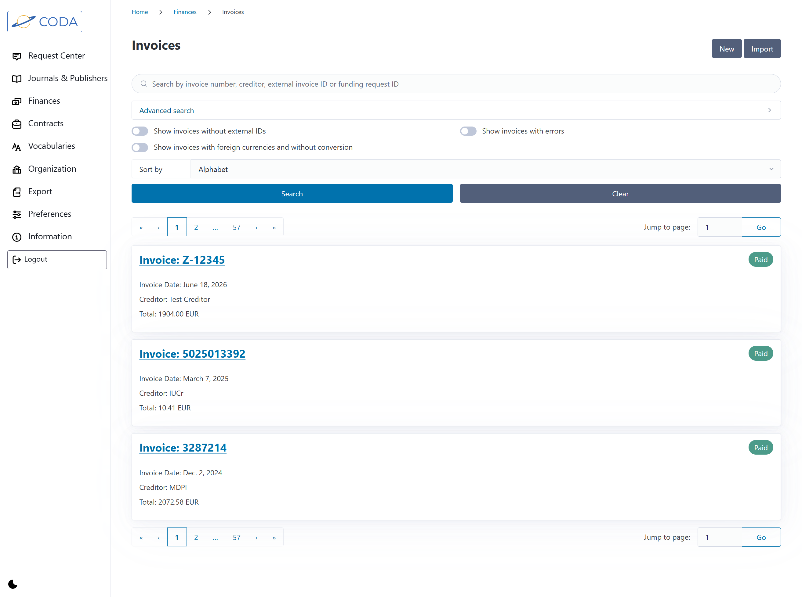
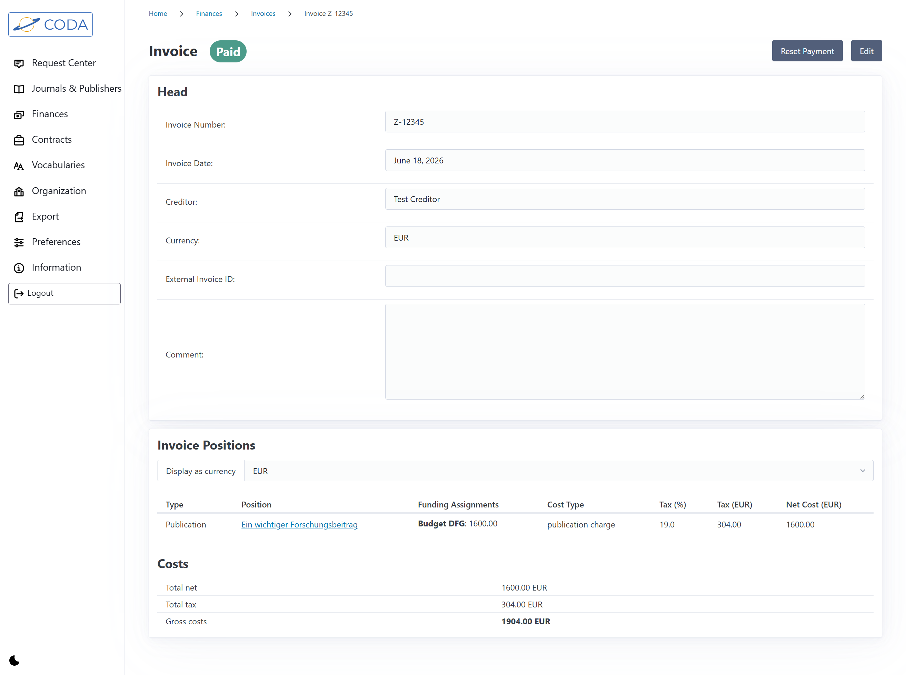

<div align="center">
   
</div>

---

CODA is a web application for managing and processing funding requests for open access publication fees. It provides a complete workflow from request submission through approval, invoicing, and reporting — designed for academic libraries and research institutions.

---

<table border="0">
  <tr>
    <td align="center" valign="top" colspan="2">
      <a href="docs/_static/img/readme/exports_fundingrequest_light.png" title="Export funding requests" target="_blank">
        <picture>
          <source media="(prefers-color-scheme: dark)" srcset="docs/_static/img/readme/exports_fundingrequests_dark.png">
          
        </picture>
      </a>
    </td>
  </tr>
  <tr>
    <td align="center" valign="top">
      <a href="docs/_static/img/readme/fundingrequests_list_light.png" title="Funding requests list" target="_blank">
        <picture>
          <source media="(prefers-color-scheme: dark)" srcset="docs/_static/img/readme/fundingrequests_list_dark.png">
          
        </picture>
      </a>
    </td>
    <td align="center" valign="top">
      <a href="docs/_static/img/readme/fundingrequests_detail_light.png" title="Funding request detail" target="_blank">
        <picture>
          <source media="(prefers-color-scheme: dark)" srcset="docs/_static/img/readme/fundingrequests_detail_dark.png">
          
        </picture>
      </a>
    </td>
  </tr>
  <tr>
    <td align="center" valign="top">
      <a href="docs/_static/img/readme/invoices_list_light.png" title="Invoices list" target="_blank">
        <picture>
          <source media="(prefers-color-scheme: dark)" srcset="docs/_static/img/readme/invoices_list_dark.png">
          
        </picture>
      </a>
    </td>
    <td align="center" valign="top">
      <a href="docs/_static/img/readme/invoices_detail_light.png" title="Invoice detail" target="_blank">
        <picture>
          <source media="(prefers-color-scheme: dark)" srcset="docs/_static/img/readme/invoices_detail_dark.png">
          
        </picture>
      </a>
    </td>
  </tr>
</table>

---

## Table of Contents

- [Features ✨](#features)
- [Quick Start 🚀](#quick-start)
  - [Prerequisites](#prerequisites)
  - [Deployment](#deployment)
- [Development ⚙️](#development)
  - [Project management](#project-management)
  - [Pre-commit configuration](#pre-commit-configuration)
    - [Committing](#committing)
- [Documentation 📝](#documentation)
- [Get in Touch with us! 📬](#get-in-touch-with-us)
- [License 📄](#license)

## Features ✨

- 🪄 **Multi-step funding request wizard** — create requests for articles and monographs with DOI-based metadata import; manage metadata, payment status, and contract linking
- ⚖️ **Review workflow** — approve, reject, or mark requests in progress
- 🏢 **External Funding Organizations** - link (multiple) funders, project IDs and project names to funding requests
- 💰 **Invoice management** — link publications and contracts to invoices via specific positions, associate with creditor and track payment status
- 💼 **Creditors** - manage creditors and associate them with invoices
- 💵 **Funding Sources** - funding sources can be linked to invoice positions to associate budget with publications
- 📰 **Publisher & journal management** — CODA comes with a database of over 26,000 journals and associated publishers, new entities can be added if needed
- 🚫 **Blocklist** — blocklist journals and publishers with periodic review scheduling
- 🤝 **Contract management** — contracts with consolidated and per-publication billing, can be referenced on invoices and linked to publications via funding requests
- 🗂️ **Controlled vocabularies** — standardized hierarchical subject areas (DFG subject classification) and publication types (COAR Resource Types) with customizable limited vocabulary subsets
- 🏛️ **Institution management** — use hierarchical organization structure for author affiliations and cost splitting, import/export and archive when needed
- 📊 **openCost reporting** — generate standardized XML cost reports with validation
- 💾 **CSV exports** — filter-based export of funding requests and their associated costs
- ⚙️ **Global preferences** — configure home currency, home institution, and vocabulary selection

## Quick Start 🚀

### Prerequisites

- Docker and Docker Compose

### Deployment

1. Clone the repository and change to the newly created `coda` directory:
   ```
   git clone https://github.com/coda-oa/coda
   cd coda
   ```

2. Prepare environment variables:

   In `coda.env` you can set which port CODA will be run under by adjusting the `CODA_EXPOSED_PORT` variable.

   In `django.env` you must set the following variables:

   ```{code-block}
   DJANGO_SECRET_KEY=<your-secret-key>
   DJANGO_ALLOWED_HOSTS=<your-allowed-hosts>
   DJANGO_CSRF_TRUSTED_ORIGINS=<your-trusted-origins>
   ```

   `DJANGO_ALLOWED_HOSTS` and `DJANGO_CSRF_TRUSTED_ORIGINS` should generally point to the same hosts. For example, if CODA is running on the address `coda.example.com`, then these variables could look as follows:

   ```
   DJANGO_ALLOWED_HOSTS=coda.example.com
   DJANGO_CSRF_TRUSTED_ORIGINS=https://coda.example.com
   ```

   In `postgres.env` you need to set a password for the database:

   ```{code-block}
   POSTGRES_PASSWORD=<your-password>
   ```

3. Start the application:
   ```
   ./commands/start-coda.sh --production
   ```

For a full deployment guide (local and production), see the [documentation](https://coda-oa.github.io/coda/users/installation.html).

## Development ⚙️

We provide a Docker Compose and devcontainer configuration to develop CODA in a Docker environment. Using an editor or IDE with devcontainer support (like VS Code or PyCharm) should be enough to get started. All necessary dependencies will be installed in the devcontainer.

When launching the devcontainer, CODA will automatically be started at `localhost:8000`.

### Project management

CODA uses `pdm` to manage the project and its dependencies. See [pdm's documentation](https://pdm-project.org/en/latest/) for more details.

### Pre-commit configuration

CODA uses a strict `pre-commit` configuration that runs checks before allowing a commit:

1. **mypy** — static type checking in strict mode
2. **ruff** — linting and code style enforcement
3. **black** — deterministic code formatting
4. **djlint** — Django template linting
5. **commitizen** — enforces [conventional commits](https://www.conventionalcommits.org/en/v1.0.0/)

#### Committing

As we use `commitizen` to ensure correct commit formatting, we recommend using its command-line tool to generate the commit message:

```
pdm run cz commit
```

## Documentation 📝

Full documentation about all the features is available at [https://coda-oa.github.io/coda/](https://coda-oa.github.io/coda/).

## Get in Touch with us! 📬

- **Project Website**: [The website of the Adore-OA project](https://www.tu-braunschweig.de/en/ub/about-us/projects-overview/adore-oa)
- **Matrix**: [Get in touch with us by joining our matrix space](https://matrix.to/#/#coda:matrix.tu-bs.de)
- **Demo**: [Try our demo installation yourself!](https://coda-demo.ub.tu-braunschweig.de/)

## License 📄

CODA is licensed under the [GNU General Public License v3.0 or later](LICENSE).
