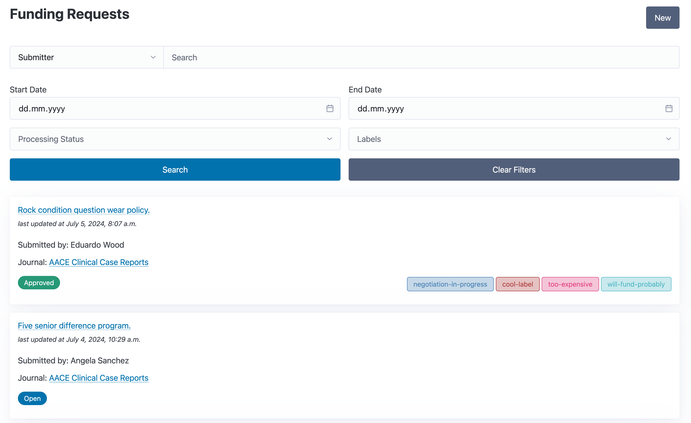

# Funding Requests

The Funding Requests feature allows your institution to monitor and review incoming requests.

## Overview

The overview page displays a list of Funding Requests and offers various filter options to customize the displayed requests.
A badge displays the current review status, while labels on the right can provide additional means to categorize the request.

```{admonition} Note
The filter options are still limited and will be expanded to allow filtering for arbitrary fields in the future!
```




## Creating a new Funding Request

The creation of Funding Requests is split up into separate steps to record the request submitter, information about the publication, the journal and data about estimated cost and funding sources.

### Request Submitter


```{toctree}
:maxdepth: 1

invoices
```